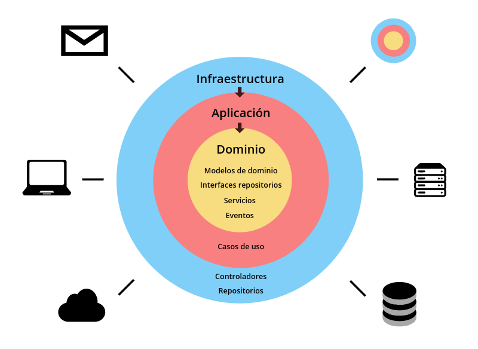
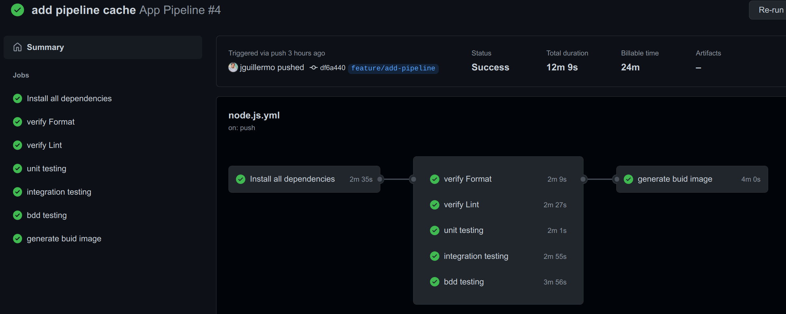

# # BLOQUE 1 NestJS API
Este ejemplo está desarrollado con el paradigma de programación Domain Driven Design DDD, para este ejemplo se tomó como dominio la plataforma e-learning, después de un análisis se obtuvieron estos 3 módulos:

- Cursos
- Matrícula
- Estudiantes

Estos módulos tienen alta cohesión y bajo acoplamiento, la forma de comunicación entre ellos es con CQRS y Eventos de Dominio. Para poder reutilizar código se creó un módulo Share, donde estan guardadas todas las clases que se usan en más de un módulo.
```
📦src
 ┣ 📂course
 ┣ 📂enrollment
 ┗ 📂student
```

La aplicación está desarrollado con graphQl, el resolver y los eventos acceden a los servicios a través de CQRS.
```
📦src/course/infrastructure
 ┣ 📂graph-ql
 ┃ ┣ 📜course.resolver.ts
 ┣ 📂event
 ┃ ┣ 📜resource-on-course-created.ts
 ┃ ┣ 📜...
```

Vamos a analizar la estructura del proyecto, los resolver y eventos están dentro de la carpeta infrastructure de cada módulo.

## Iniciar el proyecto

NOTA: tener instalado docker composer versión 2
```
Docker Compose version v2.0.1
```
si en algún momento da algun error, hay un comando make que borra todos los contenedores docker que están corriendo
```
make docker-prune
```

Para instalar las dependencias el proyecto ejecutar, la primera vez va a demorar porque tiene que crear la imagen para poder correr el contenedor

```bash
make install
```

Para iniciar el proyecto
```bash
make up
```

debe salir esto por consola

```bash                                                                                                                                                                                                                                                    0.2s
[+] Running 3/3
 ⠿ Network prueba-node_api           Created                                                                                                                                                                                                0.0s
 ⠿ Container prueba-node-backend-1   Started                                                                                                                                                                                                0.5s
 ⠿ Container prueba-node-frontend-1  Started  
```

ver los log de backend nestJS
```bash
make log-backend
```
```bash                                                                                                                                                                                                                                                    0.2s
prueba-node-backend-1  | 
prueba-node-backend-1  | [2:38:29 AM] Found 0 errors. Watching for file changes.
prueba-node-backend-1  | 
prueba-node-backend-1  | [Nest] 103  - 05/03/2022, 2:38:29 AM     LOG [NestFactory] Starting Nest application...
prueba-node-backend-1  | [Nest] 103  - 05/03/2022, 2:38:29 AM     LOG [InstanceLoader] AppModule dependencies initialized +43ms
prueba-node-backend-1  | [Nest] 103  - 05/03/2022, 2:38:29 AM     LOG [InstanceLoader] ShareModule dependencies initialized +0ms
prueba-node-backend-1  | [Nest] 103  - 05/03/2022, 2:38:29 AM     LOG [InstanceLoader] CqrsModule dependencies initialized +1ms
prueba-node-backend-1  | [Nest] 103  - 05/03/2022, 2:38:29 AM     LOG [InstanceLoader] CourseModule dependencies initialized +1ms
prueba-node-backend-1  | [Nest] 103  - 05/03/2022, 2:38:29 AM     LOG [InstanceLoader] EnrollmentModule dependencies initialized +0ms
prueba-node-backend-1  | [Nest] 103  - 05/03/2022, 2:38:29 AM     LOG [InstanceLoader] StudentModule dependencies initialized +0ms
prueba-node-backend-1  | [Nest] 103  - 05/03/2022, 2:38:29 AM     LOG [InstanceLoader] GraphQLSchemaBuilderModule dependencies initialized +0ms
prueba-node-backend-1  | [Nest] 103  - 05/03/2022, 2:38:29 AM     LOG [InstanceLoader] GraphQLModule dependencies initialized +1ms
prueba-node-backend-1  | [Nest] 103  - 05/03/2022, 2:38:29 AM     LOG [GraphQLModule] Mapped {/graphql, POST} route +118ms
prueba-node-backend-1  | [Nest] 103  - 05/03/2022, 2:38:29 AM     LOG [NestApplication] Nest application successfully started +3ms
```

```bash
make log-frontend
```
```bash                                                                                                                                                                                                                                                    0.2s
prueba-node-frontend-1  | Initial Chunk Files   | Names         |  Raw Size
prueba-node-frontend-1  | vendor.js             | vendor        |   3.38 MB |
prueba-node-frontend-1  | polyfills.js          | polyfills     | 294.79 kB |
prueba-node-frontend-1  | styles.css, styles.js | styles        | 251.38 kB |
prueba-node-frontend-1  | main.js               | main          |  27.04 kB |
prueba-node-frontend-1  | runtime.js            | runtime       |   6.51 kB |
prueba-node-frontend-1  | 
prueba-node-frontend-1  | | Initial Total |   3.95 MB
prueba-node-frontend-1  | 
prueba-node-frontend-1  | Build at: 2022-05-03T02:38:29.124Z - Hash: 3036f356e9683ee8 - Time: 3616ms
prueba-node-frontend-1  | 
prueba-node-frontend-1  | ** Angular Live Development Server is listening on 0.0.0.0:4200, open your browser on http://localhost:4200/ **
prueba-node-frontend-1  | 
prueba-node-frontend-1  | 
prueba-node-frontend-1  | ✔ Compiled successfully.
```

Para correr los test (unit, infrastructure, e2e)

```bash
make test
```

Para detener la aplicación

```bash
make down
```

## Ejecutar las APIs

Entrar a la web [http://localhost:3000/graphql](http://localhost:3000/graphql), Vamos a ejecutar las diferentes Query y Mutation paso a paso y vamos a explicar los eventos de dominio que se están ejecutando.

### Creando 3 alumnos

```bash
mutation {
  studentA: studentPersist(
    id: "56ff2e03-7189-4f43-9302-a74c81a9d067"
    name: "Student A"
    email: "student_a@email.com"
    createAt: "2022-03-01"
  ) {
    ... on Status {
      status
    }
    ... on Student {
      id
      name
    }
  }
  studentB: studentPersist(
    id: "3afa0d81-940e-4aef-9812-9929d685c5bf"
    name: "Student B"
    email: "student_b@email.com"
    createAt: "2022-03-02"
  ) {
    ... on Status {
      status
    }
    ... on Student {
      id
      name
    }
  }
  studentC: studentPersist(
    id: "53418eef-2c89-4835-a730-18918a28721e"
    name: "Student C"
    email: "student_c@email.com"
    createAt: "2022-03-03"
  ) {
    ... on Status {
      status
    }
    ... on Student {
      id
      name
    }
  }
}
```
la API responde
```json
{
  "data": {
    "studentA": {
      "status": "ok"
    },
    "studentB": {
      "status": "ok"
    },
    "studentC": {
      "status": "ok"
    }
  }
}
```

Aquí creo que puede saltar una duda, ¿Por qué un persist para crear un alumno, no es mejor un create?. Aquí voy a intentar argumentarlo, se creó un servicio para colocar un alumno, si el alumno existe, pues, actualiza la data, y si no existe, lo crea.

### Crear un curso

Con fines de demo, cuando se registra un curso, todos los alumnos que estan registrados en la db, pasan a estar matriculados en este curso, este trabajo lo hace el modulo course, con el evento **ResourceOnCourseCreated**

```bash
mutation {
  coursePersist(
    id: "3cbd3f87-213d-4e14-a841-c08492942d69"
    name: "Course A"
    startAt: "2022-03-01"
    endAt: "2022-05-01"
  ) {
    ... on Status {
      status
    }
    ... on Course {
      id
      name
    }
  }
}
```
La API responde
```json
{
  "data": {
    "coursePersist": {
      "status": "ok"
    }
  }
}
```

- Aqui tambien estoy usando un persist, y en el resto de endpoint de la demo, asi en el CRUD el Create y Update son el mismo servicio. quedaria como CRD o RUD.... XD.
- Al persistir el curso, el sistema se da cuenta que es un curso nuevo y se lanza el evento courseCreated y se matriculan a este curso los 3 alumnos antes creados.
- El aggregate Course tiene una propiedad "enrollments" donde se guarda el número total de alumnos matriculados a este curso. Esta información se actualiza en otro evento "ResourceOnEnrollmentCreated", asi la data se actualiza siempre con consistencia eventual.


### Listar los alumnos matriculados al curso.
```bash
query {
  enrollmentList(course: "3cbd3f87-213d-4e14-a841-c08492942d69") {
    id
    student {
      name
      email
    }
  }
}
```
retorna la lista del modulo enrollment, y adiciona la informacion de los alumnos, esto se hace con GraphQL
```json
{
  "data": {
    "enrollmentList": [
      {
        "id": "b3c2454a-52db-59aa-914f-2a50ac687e4c",
        "student": {
          "name": "Student A",
          "email": "student_a@email.com"
        }
      },
      {
        "id": "d270953b-2796-5105-9d00-3830c1eb6374",
        "student": {
          "name": "Student C",
          "email": "student_c@email.com"
        }
      },
      {
        "id": "fcd29461-2fd7-540c-b69c-30cc181fb4cd",
        "student": {
          "name": "Student B",
          "email": "student_b@email.com"
        }
      }
    ]
  }
}
```
Aqui hay un punto importante que tratar, la información se extrae de 2 módulos "enrollment" y "student", para unir esta data hay varias formas de trabajarlo, se puede persistir la información del estudiante en el módulo "enrollment" a través de consistencia eventual. En esta demo, se trae la data a través de CQRS.

### Retirar a un alumno del curso
```bash
mutation {
  enrollmentDelete(id: "b3c2454a-52db-59aa-914f-2a50ac687e4c") {
    status
  }
}
```
debe responder
```json
{
  "data": {
    "enrollmentDelete": {
      "status": "ok"
    }
  }
}
```
Aquí tambien se esta lanzando un evento "ResourceOnEnrollmentDeleted" esto actualiza el numero de alumnos matriculados del modulo "course"

## Test
### Test unitarios
en estos test, estamos validando los DTO que ingresan a la APP. para ejecutar un test se debe crear un archivo xxx.spec.ts y poner todos los casos de prueba.
```bash
make test-unit 
```
```bash                                                                                                                                                                                                                                                    0.2s
> backend-project@0.0.1 test
> jest

 PASS  src/enrollment/application/persist/enrollment-persist.dto.spec.ts
 PASS  src/course/application/persist/course-persist.dto.spec.ts
 PASS  src/student/application/persist/student-persist.dto.spec.ts

Test Suites: 3 passed, 3 total
Tests:       6 passed, 6 total
Snapshots:   0 total
Ran all test suites.
```
### Test de integración
aqui se va a tesetear todas la integracion externas que tiene la aplicación. En esta demo se esta testeando las clases de Repositorio, para no tener test frágiles se esta testeando con el metodo de ObjectMother.

``` javascript
//course-object-mother.ts
export class CourseMother {
  static create(data?: CourseDataInterface): Course {
    return new Course(
      CourseIdMother.create(data?.id),
      CourseNameMother.create(data?.name),
      CourseStartAtMother.create(data?.startAt),
      CourseEndAtMother.create(data?.endAt),
      CourseEnrollmentsMother.create(data?.enrollments),
    );
  }
}


//course-repository.e2e-spec.ts
const student = StudentMother.create();
await repository.persist(student);
```
```bash
make test-integration
```
```bash
 PASS  test/infrastructure/enrollment/enrollment-repository.e2e-spec.ts
  EnrollmentRepository
    ✓ persist (421 ms)

 PASS  test/infrastructure/student/student-repository.e2e-spec.ts
  StudentRepository
    ✓ persist (433 ms)

 PASS  test/infrastructure/course/course-repository.e2e-spec.ts
  CourseRepository
    ✓ persist (429 ms)

Test Suites: 4 passed, 4 total
Tests:       20 passed, 20 total
Snapshots:   0 total
```

### Test de aceptación
Para este demo se trabajó con DBB con la libreria Cucumber, el test esta en la carpeta features
```
📦features
 ┣ 📂course
 ┃ ┣ 📜delete.feature
 ┃ ┣ 📜list.feature
 ┃ ┗ 📜persist.feature
 ┣ 📂enrollment
 ┃ ┣ 📜delete.feature
 ┃ ┣ 📜list.feature
 ┃ ┗ 📜persist.feature
 ┗ 📂student
 ┃ ┣ 📜list.feature
 ┃ ┗ 📜persist.feature
```
Una demo es

```gherkin
Feature: Persist Course
  In order to create course
  As an user
  I need to be able to persist Course

  Background:
    Given I have the following data on collection "students"
  """
    [
      {
        "id": "daf673b7-b1ba-415e-ac5e-04848e5e2e5f",
        "name": "Student A",
        "email": "student@email.com",
        "createAt": "Date(2022-03-01)"
      },
      {
        "id": "00a285d1-e4f0-4ad3-80f9-c306bb4967eb",
        "name": "Student B",
        "email": "student_b@email.com",
        "createAt": "Date(2022-03-02)"
      }
    ]
    """

  Scenario: Create Course
    Given I make a request to graphql
    """
    mutation{
      coursePersist(
        id: "daf673b7-b1ba-415e-ac5e-04848e5e2e5f"
        name: "Course A"
        startAt: "2022-03-01"
        endAt: "2022-05-01"
      ){
        ...on Status{
          status
        }
        ...on Course{
          id
          name
        }
      }
    }
    """
    And I validate the response is
    """
    {
      "data": {
        "coursePersist": {
            "status": "ok"
         }
       }
    }
    """
    Then response should have a status 200
    And I validate the following data exists on collection "courses"
    """
    [
      {
        "id": "daf673b7-b1ba-415e-ac5e-04848e5e2e5f",
        "name": "Course A",
        "startAt": {
          "_nanoseconds": 0,
          "_seconds": 1646092800
        },
        "endAt": {
           "_nanoseconds": 0,
           "_seconds": 1651363200
        },
        "enrollments": 0
      }
    ]
    """
    And I sleep 4 seconds
    And I validate the following data exists on collection "courses"
    """
    [
      {
        "id": "daf673b7-b1ba-415e-ac5e-04848e5e2e5f",
        "name": "Course A",
        "startAt": {
          "_nanoseconds": 0,
          "_seconds": 1646092800
        },
        "endAt": {
           "_nanoseconds": 0,
           "_seconds": 1651363200
        },
        "enrollments": 2
      }
    ]
    """
    And I validate on "enrollments" length is 2
```
Talvez se pregunte porque dentro del test hay un sleep de 4 segundos, es porque los eventos son asíncronos y la información no está actualizada en la base de datos, esto es algo que se debe mejorar, lo tengo anotado en un "TO DO"


## Arquitectura hexagonal en cada módulo

Los módulos estan dentro de la carpeta src y modelan la lógica de la escuela, vamos a analizar el módulo Course



- **Infraestructura**: Se encarga de persir la data, ejecutar los eventos y la implementacion de graphQL.
- **Application**: Aquí están todos nuestros casos de uso: Crear, Borrar, Buscar, los casos de uso estan implemnetados con CQRS, para que puedan ser usados desde otros lados del proyecto, desde un controlador, evento o otro caso de uso(aunque esta última forma no es muy recomendada).
- **Domain**: aqui se modelan los agregates, value object, eventos de dominio.
```
📦course
 ┣ 📂application
 ┃ ┣ 📂delete
 ┃ ┃ ┣ 📜course-delete.dto.ts
 ┃ ┃ ┣ 📜course-delete.handler.ts
 ┃ ┃ ┗ 📜course-delete.service.ts
 ┃ ┣ 📂list
 ┃ ┃ ┗ 📜...
 ┃ ┣ 📂persist
 ┃ ┃ ┗ 📜...
 ┃ ┣ 📂update-enrollment
 ┃ ┃ ┗ 📜...
 ┃ ┣ 📜course.response.ts
 ┃ ┣ 📜index.ts
 ┃ ┗ 📜list-course.response.ts
 ┣ 📂domain
 ┃ ┣ 📜course-created.event.ts
 ┃ ┣ 📜course-deleted.event.ts
 ┃ ┣ 📜course-end-at.ts
 ┃ ┣ 📜...
 ┣ 📂infrastructure
 ┃ ┣ 📂event
 ┃ ┃ ┣ 📜resource-on-course-created.ts
 ┃ ┃ ┗ 📜resource-on-course-deleted.ts
 ┃ ┣ 📂graph-ql
 ┃ ┃ ┣ 📜course.resolver.ts
 ┃ ┃ ┗ 📜course.type.ts
 ┃ ┗ 📂persistence
 ┃ ┃ ┣ 📜course-firestore.repository.ts
 ┃ ┃ ┗ 📜course.dao.ts
 ┗ 📜course.module.ts
```

## GraphQl
Los resolver mandan el Commad a Bus y Command Query, con esto los resolver están separados de los servicios, desacoplando de esta manera el resolver y los casos de uso.

```javascript
@Resolver(() => CourseType)
export class CourseResolver {
    constructor(private commandBus: CommandBus, private queryBus: QueryBus) {}

    @Mutation(() => ResultCoursePersist, { name: 'coursePersist' })
    async persist(@Args() args: CoursePersistDto) {
        await this.commandBus.execute(args);
        return args.showEntity ? await this.queryBus.execute(new CourseFindByIdDto(args.id)) : ResponseStatus.ok();
    }
}
```
Se implemento usando nest graphQL, para cambiarlo a Restfull, tenemos que modificar esta capa de infrastucture y crear los controller, siempre llamando a los casos de uso usando CQRS, con eso, tampoco es necesario modificar la lógica de la aplicacion.

## Base de datos
- Firestore es un motor de base de datos serverless de google.
- Talvez sea raro que este usando firestore como motor de base de datos. Con esto también queria mostrar que para la filosofia DDD, la tecnología de persistencia pasa a un segundo plano. En DDD nos preocupamos más en implementar modelos de negocio. 
- Para usar una base de datos diferente se debe crear un repositorio nuevo para este ejemplo "student-postgres.repository.ts". También debes crear test de integración para esta nueva implementación.
```
📦infrastructure
 ┣ 📂...
 ┗ 📂persistence
 ┃ ┣ 📂postgres
 ┃ ┃ ┗ 📜student-postgres.repository.ts
 ┃ ┣ 📜student-firestore.repository.ts
 ┃ ┗ 📜student.dao.ts
```
 y remplazar la clase "StudentFirestoreRepository" por la nueva clase que se implementó "StudentPostgresRepository" 
```
@Module({
  providers: [
    {
      provide: StudentRepository,
    -  useClass: StudentFirestoreRepository,
    +  useClass: StudentPostgresRepository,
    },
    ...
  ],
})
export class StudentModule {}
```

## ¿Por qué trabajar de esta forma?

Es verdad que al inicio trabajar de esta forma toma más tiempo el desarrollar las aplicaciones, pero la flexibilidad e independencia que se logra, es para que este proyecto pueda crecer en el tiempo y no tener que pensar en reescribir la aplicaion porque ya se volvió imposible de mantener. Pero calma, hay una forma de trabajar de esta forma y aun asi obtener tiempos cortos en el desarrollo, hay una herramienta que genera código [https://github.com/jguillermo/cli-ddd](https://github.com/jguillermo/cli-ddd) lo he desarrollado hace algunos meses, esta librería me ayudó a crear esta demo.


## Pipe line

El código esta con Github Actions, se puede ver una demo del último pase en [https://github.com/jguillermo/nestjs-test/actions](https://github.com/jguillermo/nestjs-test/actions)




## Conclusiones
Fue interesante armar un skeleton con arquitectura hexagonal con NestJS y estoy feliz con el resultado, NestJS ayudó un montón para el CQRS y los eventos de dominio. lo dejo aquí a la espera de nuevas ideas para mejorar la arquitectura, espero tu PR.
